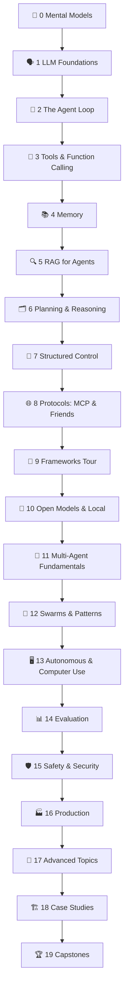

# AI Agents From Scratch

```
░░░░░░░░░░░░░░░░░░░░░░░░░░░░░░░░░░░░░░░░░░░░░░░░░░░░░░░░░░░░░░░░░░░░░░
░░                                                                  ░░
░░        ┌──────────────── THE AGENT LOOP ────────────────┐        ░░
░░        │                                                │        ░░
░░        │   ┌─────────┐    ┌─────────┐    ┌─────────┐    │        ░░
░░   ─────┼──▶│ OBSERVE │───▶│  THINK  │───▶│   ACT   │────┼─────   ░░
░░        │   └─────────┘    └─────────┘    └────┬────┘    │        ░░
░░        │        ▲          ┌────────┐         │         │        ░░
░░        │        └──────────│ MEMORY │◀────────┘         │        ░░
░░        │                   └────────┘                   │        ░░
░░        └────────────────────────────────────────────────┘        ░░
░░                                                                  ░░
░░░░░░░░░░░░░░░░░░░░░░░░░░░░░░░░░░░░░░░░░░░░░░░░░░░░░░░░░░░░░░░░░░░░░░
```

**212 lessons. 20 phases. Every agent pattern built as a bare while-loop
before a single framework gets imported.**

You don't just use agents. You build them — the loop, the tools, the
memory, the swarm — by hand, offline, with a deterministic mock LLM.
Then you plug in the real thing.

- 🔄 **The loop first** — every framework is ~100 lines of while-loop wearing a trench coat; you'll write those lines yourself
- 🔌 **Zero API keys required** — all `code/` and `projects/` run offline against a scripted MockLLM; real-provider adapters are one function away
- 👥 **Multi-agent, properly** — orchestrators, handoffs, swarms, debate, market mechanisms, and when a single agent beats them all
- 🦙 **Open models included** — Hermes, Llama, Qwen tool-calling formats, Ollama/vLLM serving, fully local stacks
- 🛡️ **Security is a phase, not a footnote** — prompt injection, the lethal trifecta, sandboxing, permissioning
- ✅ **Checkpoints everywhere** — every lesson ends with quiz questions so you can't lie to yourself
- 💸 **Free forever** — MIT licensed, no paywalls

## The Seven-Beat Lesson Pattern

| Beat | What it does |
|---|---|
| **MOTTO** | The whole lesson in one sentence |
| **PROBLEM** | The concrete pain that makes this topic exist |
| **CONCEPT** | Intuition first — analogies and ASCII diagrams before jargon |
| **BUILD IT** | The mechanism, from scratch — code or step-by-step mechanics |
| **USE IT** | The production tools/frameworks that do this for you (and their tradeoffs) |
| **WAR STORY** | A real incident, paper, or engineering legend |
| **CHECKPOINT** | Quiz questions — if you can't answer, re-read |

## The 20 Phases



| # | Phase | Lessons | You will be able to… |
|---|---|---|---|
| 0 | [🧠 Setup & Mental Models](phases/00-setup-and-mental-models/README.md) | 8 | See every agent as a loop with a brain |
| 1 | [🗣️ LLM Foundations for Agents](phases/01-llm-foundations/README.md) | 12 | Engineer context, not just prompts |
| 2 | [🔄 The Agent Loop](phases/02-the-agent-loop/README.md) | 10 | Write ReAct in 100 lines, cold |
| 3 | [🔧 Tools & Function Calling](phases/03-tools-and-function-calling/README.md) | 12 | Design tools agents don't misuse |
| 4 | [📚 Memory](phases/04-memory/README.md) | 10 | Give agents a real hippocampus |
| 5 | [🔍 RAG for Agents](phases/05-rag-for-agents/README.md) | 12 | Ground answers in your data, with citations |
| 6 | [🗂️ Planning & Reasoning](phases/06-planning-and-reasoning/README.md) | 12 | Decompose, plan, verify, replan |
| 7 | [🧩 Structured Outputs & Control](phases/07-structured-control/README.md) | 10 | Wrap stochastic cores in deterministic scaffolds |
| 8 | [🌐 Protocols: MCP & Friends](phases/08-protocols/README.md) | 12 | Build and secure MCP servers |
| 9 | [🤖 The Frameworks Tour](phases/09-frameworks/README.md) | 12 | Choose LangGraph vs CrewAI vs nothing |
| 10 | [🦙 Open Models & Local Agents](phases/10-open-models/README.md) | 10 | Run Hermes-class agents on your own box |
| 11 | [👥 Multi-Agent Fundamentals](phases/11-multi-agent-fundamentals/README.md) | 12 | Orchestrate workers without chaos |
| 12 | [🐝 Swarms & Advanced Patterns](phases/12-swarms-and-patterns/README.md) | 10 | Get emergence without anarchy |
| 13 | [🖥️ Autonomous & Computer-Use Agents](phases/13-autonomous-agents/README.md) | 10 | Build agents that code and click |
| 14 | [📊 Evaluation & Benchmarks](phases/14-evaluation/README.md) | 10 | Measure agents like an adult |
| 15 | [🛡️ Safety & Security](phases/15-safety-and-security/README.md) | 10 | Defend against prompt injection for real |
| 16 | [🏭 Production Agents](phases/16-production/README.md) | 12 | Ship agents that survive Monday |
| 17 | [🧪 Advanced Topics](phases/17-advanced-topics/README.md) | 10 | Read the frontier without drowning |
| 18 | [🏗️ Case Studies — Design Real Agents](phases/18-case-studies/README.md) | 10 | Whiteboard the agents people pay for |
| 19 | [🏆 Capstone Projects](phases/19-capstones/README.md) | 8 | Ship real agents, then teams of them |

## Runnable Code (no API keys needed)

Every primitive gets a from-scratch, dependency-free Python implementation
in [`code/`](code/) — powered by a deterministic **MockLLM** so demos run
offline and reproducibly. Swap in a real provider by implementing one
`complete()` function.

```
code/
├── mock_llm.py            # the deterministic fake brain all demos share
├── agent_loop.py          # ReAct loop: observe → think → act
├── tool_router.py         # schemas, dispatch, error handling
├── memory_store.py        # buffer + summary + vector-ish recall
├── rag_pipeline.py        # chunk → index (TF-IDF) → retrieve → cite
├── planner.py             # plan-and-execute with replanning
├── structured_output.py   # JSON schema validation + repair loop
├── mcp_server.py          # minimal MCP-style JSON-RPC over stdio
├── multi_agent.py         # orchestrator-worker with handoffs
├── swarm_sim.py           # blackboard + auction task allocation
├── evals.py               # trajectory eval harness with rubrics
└── guardrails.py          # injection detection + permission gates
```

Run any of them: `python code/agent_loop.py` — each file is a lesson in
itself, with a demo in `__main__`.

## Hands-On Projects

Real multi-component agent systems in [`projects/`](projects/), each with
a build guide and a runnable offline reference:

| Project | You build | Run it |
|---|---|---|
| [`coding-agent-lite/`](projects/coding-agent-lite/) | An agent that edits files and reruns tests until green | `python projects/coding-agent-lite/agent.py --demo` |
| [`research-agent/`](projects/research-agent/) | Search → read → synthesize → cited report | `python projects/research-agent/agent.py --demo` |
| [`support-agent/`](projects/support-agent/) | Router + tools + escalation to a human | `python projects/support-agent/agent.py --demo` |
| [`multi-agent-newsroom/`](projects/multi-agent-newsroom/) | Planner, researcher, writer, editor — one story | `python projects/multi-agent-newsroom/newsroom.py --demo` |
| [`mcp-toolbox/`](projects/mcp-toolbox/) | A real MCP server + client over stdio | `python projects/mcp-toolbox/client.py --demo` |
| [`agent-eval-harness/`](projects/agent-eval-harness/) | Task suite, graders, scorecard, regression gate | `python projects/agent-eval-harness/harness.py --demo` |

## How to Use This

1. **Beginner?** Start at Phase 0 and go in order — the phases form a
   dependency chain.
2. **Already shipping agents?** Jump to the phase that scares you.
   Multi-agent starts at 11; security at 15; production at 16.
3. **Framework refugee?** Do Phases 2–3 to see what your framework was
   hiding, then Phase 9 to judge it fairly.
4. **Track progress** on the website — checkboxes persist in your browser,
   and every lesson title links to a styled reader page.

The website lives in [`site/`](site/) — open `site/index.html` directly,
no server needed. Reader pages are generated from the phase markdown:
`python scripts/build_site.py` (rerun after editing any lesson).

## Philosophy

> Frameworks change. Loops are forever.

When you've written the agent loop yourself, every framework becomes
readable. When you've built memory, RAG, and handoffs by hand, every
architecture diagram is familiar. And when you've attacked your own
agent with prompt injection, you'll never ship the naive version again.
This curriculum optimizes for the knowledge that transfers.

## License

MIT. Use it, fork it, teach with it.
